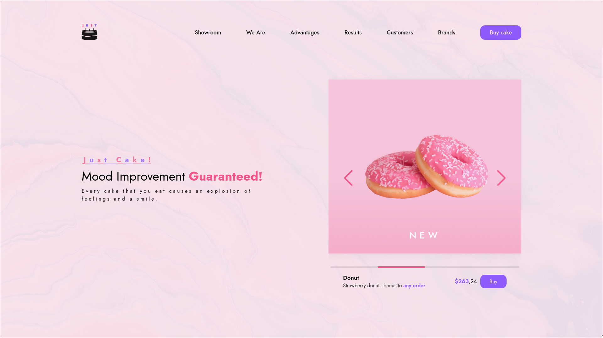
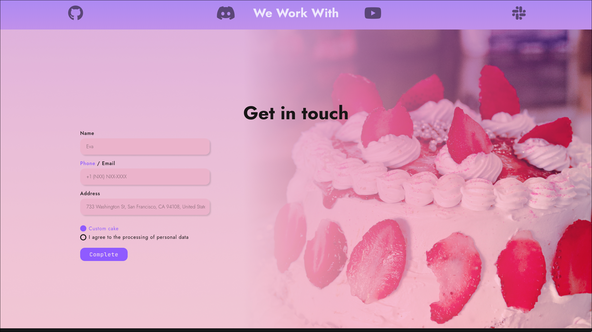

Live demo: [GitHub Pages link](https://moonimori.github.io/just-cake/)<br />
<span>Designed by <a href="https://github.com/empt1nesss">empt1nesss</a></span><br />
# Just Cake


## About

Just Cake is a simple, visually appealing web project that showcases cakes, cupcakes, and happy customers. It’s a front-end portfolio piece designed to demonstrate HTML, SCSS, and JavaScript skills through layout, styling, and interactive effects

## Description

This project is a static template that includes:

- Beautiful images of cakes, cupcakes, and happy customers
- Clean and responsive layout
- Basic interactivity using Vanilla JavaScript
- Styling with SCSS for modern CSS practices

## Screenshots




Live demo: [GitHub Pages link](https://moonimori.github.io/just-cake/)

## Technologies Used

- HTML5
- CSS3 / SCSS
- JavaScript (Vanilla ES6+)
- Git & GitHub

## Installation / Usage

1. Clone the repository:

```bash
git clone https://github.com/moonimori/just-cake.git
```

Open index.html in your browser

No build tools or frameworks are required — the project runs in any modern browser
